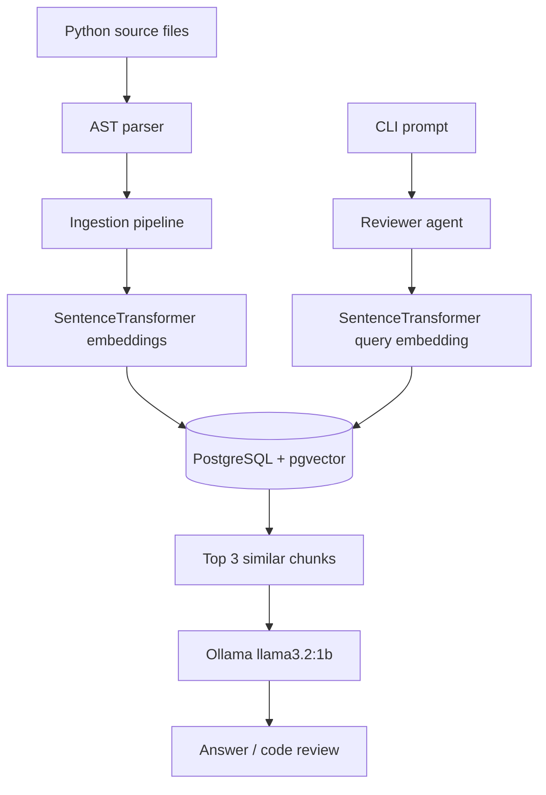

# Code-Lens

Code-Lens is a local, AST-aware software engineering agent that indexes a Python codebase, stores chunk embeddings in PostgreSQL with pgvector, and uses a PydanticAI + Ollama reviewer to answer code questions or suggest fixes.

## Architecture



## How It Works

### 1. Ingestion

`src/ingestion/ast_parser.py` parses Python files into logical code chunks. The parser extracts `ClassDef`, `FunctionDef`, and `AsyncFunctionDef` nodes, preserving chunk names and source code.

`src/ingestion/pipeline.py` walks the repository, skips generated and virtual-environment folders, converts parsed chunks into embeddings with `sentence-transformers`, and writes the results to PostgreSQL using `asyncpg.executemany`.

### 2. Storage

`src/database/init_db.py` initializes PostgreSQL with the `vector` extension, creates the `code_chunks` table, and builds an HNSW cosine index on the embedding column.

### 3. Review / Query Flow

`src/agents/reviewer.py` builds a local reviewer stack that:

1. Embeds the user query with `all-MiniLM-L6-v2`.
2. Retrieves the top 3 most similar chunks from `code_chunks` using cosine distance.
3. Passes the retrieved context to Ollama through PydanticAI for the final answer.

`src/main.py` provides the interactive CLI loop.

## Features

- Local-first code intelligence pipeline
- AST-based chunking for Python source files
- PostgreSQL + pgvector similarity search
- Sentence-transformers embeddings with `all-MiniLM-L6-v2`
- PydanticAI reviewer agent
- Ollama-powered local generation with `llama3.2:1b`
- Async CLI for interactive review questions
- Clean separation between ingestion, storage, retrieval, and generation

## Project Layout

```text
src/
  agents/
    reviewer.py
  database/
    init_db.py
  ingestion/
    ast_parser.py
    pipeline.py
  main.py
docker-compose.yaml
pyproject.toml
```

## Requirements

- Python 3.12+
- `uv`
- Docker Desktop
- Ollama installed locally

## Run Sequence

Run the project in this order:

### 1. Install dependencies

```powershell
uv sync
```

### 2. Start PostgreSQL

```powershell
docker compose up -d postgres
```

### 3. Initialize the database schema

```powershell
uv run python src/database/init_db.py
```

### 4. Pull the local Ollama model

```powershell
ollama pull llama3.2:1b
```

### 5. Ingest the repository

```powershell
uv run python src/ingestion/pipeline.py
```

### 6. Start the interactive CLI

```powershell
uv run python src/main.py
```

### 7. Ask questions

```text
Code-Lens> What classes exist in the ingestion module and what do they do?
Code-Lens> exit
```

## Configuration

- `DATABASE_URL` overrides the Postgres connection string.
- `OLLAMA_MODEL` overrides the default local model name.

## Notes

- The first run of `sentence-transformers` may download the `all-MiniLM-L6-v2` model from Hugging Face if it is not already cached locally.
- If you want a different Ollama model, set `OLLAMA_MODEL` to an installed local model name before starting the CLI.